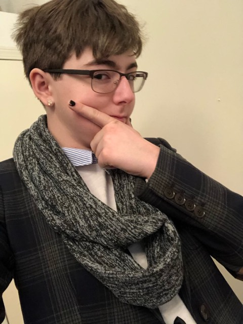

# About Us

We are both engineering students who are passionate about the future of education.
### Griffith Stites

I am an Electrical and Computer Engineering major at Olin College of Engineering.
I get a lot of satisfaction out of explaining complex subjects in simple terms.
In high school, I always wanted to know the logic behind something and roughly
how it worked, even if I did not have the knowledge for a full understanding.
I wanted to remove the black box around topics we were not supposed
to know or were supposed to assumed worked.

Contributions:

&nbsp;&nbsp;&nbsp;Created the Zine format for this project - fonts, style, etc

&nbsp;&nbsp;&nbsp;Wrote about the basics of Linear Algebra

&nbsp;&nbsp;&nbsp;&nbsp;&nbsp;&nbsp;Matrix Basics, Vectors, Eigenvalues and Eigenvectors.

&nbsp;&nbsp;&nbsp;Wrote about how SVD works on an image

&nbsp;&nbsp;&nbsp;Code and Implementation Examples

&nbsp;&nbsp;&nbsp;&nbsp;&nbsp;&nbsp;MATLAB and Python

### Alex Hindelang

I am an Engineering with Design major at Olin College of Engineering. I was drawn to this project
because I wanted to help get high school students excited about what they are
learning - especially in regards to math.

I did well in High School, but I always felt a disconnection from what I was
learning. I always wanted to see the greater purpose of something I was learning,
this project gave me the opportunity to do so.

Contributions:

&nbsp;&nbsp;&nbsp;Wrote about the SVD in detail

&nbsp;&nbsp;&nbsp;&nbsp;&nbsp;&nbsp;Mathematical interpretations, data analysis

&nbsp;&nbsp;&nbsp;Wrote about Symmetric Matrices

&nbsp;&nbsp;&nbsp;Wrote the project proposals

&nbsp;&nbsp;&nbsp;Created the educational videos
